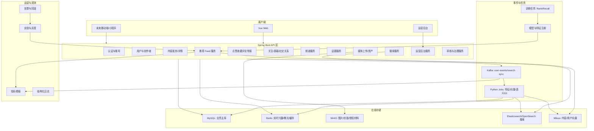
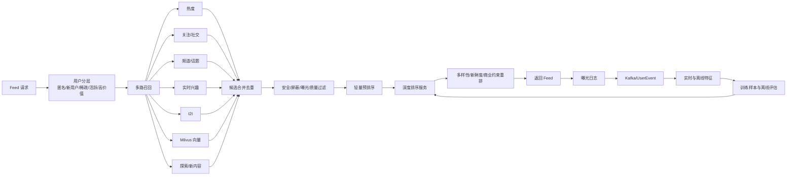
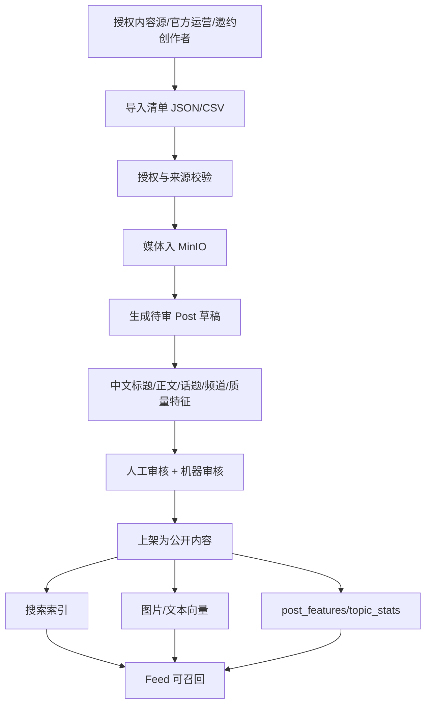
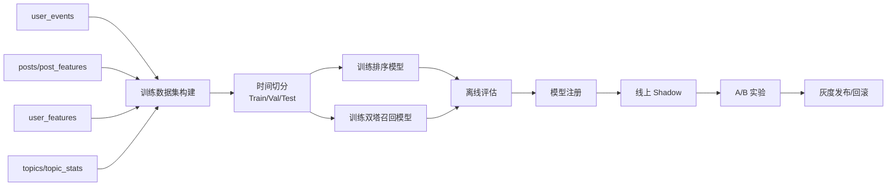

# 企业级中文内容社区建设方案

状态：审核稿  
日期：2026-05-08  
适用分支：`main`  
目标：在当前项目已经可用的发布、收藏、评论、关注、Feed 展示和推荐雏形上，分阶段建设一个可商用、可运营、可训练、可审计的中文内容社区平台。

## 1. 结论先行

当前项目不能继续把 Unsplash 迁移数据当作公开冷启动内容。Unsplash 数据可以保留为本地开发、推荐链路压测、模型训练流程演示数据，但上线冷启动必须切到“授权内容 + 官方运营内容 + 邀约创作者内容 + 审核通过的真实 UGC”。

下一步不应该急着重训大模型，也不应该推倒现有推荐链路。正确顺序是：

1. 固化当前可用链路，补齐推荐观测与数据契约。
2. 把频道和话题从硬编码改为动态运营模型。
3. 建后台内容与运营系统，支持高质量中文内容入库、审核、上架、下架、归因和授权证明。
4. 用新内容重建 MySQL、MinIO、Milvus、搜索索引和特征表。
5. 在可观测数据闭环上优化召回、排序、重排、探索、冷启动和训练流水线。
6. 再做商业化、创作者成长、广告/品牌合作、治理和规模化部署。

本方案坚持一个底线：推荐链路只能增强，不能删除。任何阶段都必须保留当前热度、社交、语义、实时兴趣、I2I、向量召回、深度排序和降级兜底的基本能力，并通过灰度开关逐步替换策略。

## 2. 当前项目基线

### 2.1 已有能力

前端：

- Vue 3 + TypeScript + Vite。
- 已有 Feed、详情、发布、互动、搜索、个人主页等基础视图。
- 已有设计图目录：`frontend/src/assets/viewDesign/reconstruct`。
- 已有 `FeedCardRenderer`、`PostDetailRenderer`、`PublishFormRenderer` 的组件化方向。
- 话题/频道在前端仍有较多静态配置痕迹。

后端：

- Spring Boot 3.5 + MyBatis Plus + Liquibase。
- 已有用户、登录、发布、媒体、互动、社交、行为、搜索、频道、分类、推荐模块。
- 当前 `posts` 已承载 `channel_code`、`post_type`、`extra`、`tags`、`topic_path`、`semantic_tags`、`style_tags`、`taxonomy_json`、`topic_cluster_key`、质量分等字段。
- 已有收藏、点赞、评论、关注、负反馈、举报、屏蔽、行为事件。
- 当前频道仍主要由 `ContentChannel` 枚举和前端配置驱动，不满足运营动态化。

推荐与数据：

- 已有 MySQL、Redis、Kafka、MinIO、Milvus、Elasticsearch、Deep Rank 服务的 Docker 编排。
- 已有特征工程、图片 embedding、语义聚类、标签词典、I2I 邻居、用户向量、离线回放评估脚本。
- Feed 已有热度、社交、内容语义、实时兴趣、显式兴趣、最近正反馈、向量、探索等召回源。
- 已有 Feed 诊断、在线指标、来源健康、配额保护等企业级雏形。

### 2.2 关键缺口

产品层：

- 频道是固定枚举，不是后台可运营资源。
- “标签”需要统一对外叫“话题”，并建立话题详情页、话题关注、话题热榜、话题合并、别名、审核和趋势。
- 缺少后台运营台：频道管理、话题管理、内容审核、导入批次、内容质量分、创作者管理、推荐实验管理。
- 搜索还没有成为内容发现主入口，ES 当前配置默认关闭。
- 缺少创作者成长体系、内容权益归属、商业合作和品牌投放闭环。

数据层：

- Unsplash 数据不适合作为公开中文社区首屏内容。
- 缺少内容授权、来源、许可、归因、审核状态、导入批次、内容质量标签。
- MinIO、Milvus、MySQL、搜索索引之间缺少统一的内容资产生命周期。
- 现有脚本更像一次性或定时任务，还没有企业级可重跑、可回滚、可审计的数据流水线。

推荐层：

- 推荐链路已有骨架，但还缺少完整的训练数据集、特征注册、模型版本、在线/离线一致性、实验注册和自动回滚。
- 当前冷启动更偏“热度 + 探索”，还没有面向中文高质量内容、频道偏好、话题偏好、创作者质量的策略。
- 缺少推荐策略对运营目标的约束：新内容扶持、低质内容抑制、作者去重、话题多样性、商业内容限频。

工程层：

- 历史 Liquibase changeset 不能再被修改，否则会再次出现 checksum 错误。后续所有数据库改动必须只追加新 changeset。
- 需要清理脚本、虚拟环境、本地数据卷和真实代码的边界，避免把本地生成数据误当成项目资产。
- 需要为企业级交付补齐 CI、环境隔离、配置密钥、监控、日志、告警和备份策略。

## 3. 外部产品参考

参考不是照搬 UI，也不是抓取数据，而是抽取成熟社区的能力边界。

### 3.1 X / Twitter 可参考的能力

X 的核心信息架构给本项目三点启发：

- 首页至少要区分“为你推荐”和“关注”，关注流只来自已关注账号，推荐流可以混入账号、话题和平台认为相关的内容。
- 趋势/热榜不是简单按数量排序，而是面向“正在发生”的话题发现，需要位置、兴趣、时间窗口和反作弊过滤。
- Lists 代表用户或平台对账号/内容源的组织能力，本项目后续可以对应为“专题合集”“精选频道源”“创作者榜单”。

### 3.2 小红书可参考的能力

小红书式社区对本项目更关键：

- 首页有发现/关注/购买等场景，图文笔记、视频笔记、长笔记、评论定位、相关笔记等能力说明内容对象不只是图片。
- 搜索不只是关键词搜索，还包括推荐词、自动补全、热搜、品牌词、品类词、话题聚合、本地/全局推荐卡片等运营入口。
- 商业系统不只是广告，它需要品牌、商家、达人、商品、小程序、笔记发布、转化入口和结算/履约等生态能力。

### 3.3 合规参考

如果平台面向中国境内公众提供个性化推荐、UGC、生成式辅助内容或商业化分发，需要在方案中预留：

- 算法推荐服务治理、算法备案、用户自主选择、推荐可解释和人工干预。
- 内容生态治理、违法不良信息处置、举报、审核、账号治理。
- 生成式 AI 辅助创作时的标识、数据来源、知识产权和安全评估。

具体法律合规最终需要律师或合规负责人确认，本方案只在工程上预留能力。

## 4. 目标产品形态

### 4.1 用户侧

首屏：

- 为你推荐：个性化推荐、冷启动精选、话题探索、优质新内容扶持。
- 关注：已关注作者内容，按时间和质量混排。
- 频道：校园生活、摄影、宠物、二次元穿搭、留学生活、AI/效率工具等可动态增删。
- 话题：可搜索、可关注、可发帖引用、可热榜、可合并别名。

内容：

- 图文笔记是基础形态。
- 标题和正文可选，但图片、正文、话题、频道至少要满足发布策略之一。
- 用户看到的是“话题”，后端可以逐步从 `tags` 兼容迁移到 `topics` 关系表。
- 频道回答“内容放在哪个产品分区”，话题回答“内容讨论什么”。

互动：

- 点赞、收藏、评论、关注、分享、负反馈、举报、屏蔽继续保留。
- 评论需要后续支持楼中楼、置顶、作者点赞、精选评论、违规折叠。

发现：

- 搜索页支持综合、笔记、用户、话题、频道。
- 话题详情页支持热门、最新、精选、相关话题、参与发布。
- 频道页支持推荐、最新、关注作者、新人精选、频道话题。

### 4.2 运营侧

后台必须支持：

- 频道管理：创建、上下架、排序、图标、导航位置、频道规则、默认话题、频道模板。
- 话题管理：创建、合并、别名、审核、推荐、置顶、热榜、风险等级、商业属性。
- 内容管理：审核、加精、置顶、下架、限流、删除、申诉、内容来源证明。
- 导入管理：批次导入、授权文件、媒体上传、失败重试、回滚、重建索引。
- 创作者管理：官方账号、邀约账号、质量分、领域、等级、权益、违规记录。
- 推荐管理：实验、策略参数、召回源配额、降级策略、指标看板、模型版本。
- 商业管理：品牌账号、合作笔记、推广标识、投放计划、预算、频控、审核。

## 5. 目标架构

### 5.1 总体架构

### 5.2 推荐架构

### 5.3 内容冷启动流水线

## 6. 核心领域模型

### 6.1 内容模型

继续以 `Post` 为统一内容对象，不为每个频道复制一套帖子表。

保留并强化：

- `posts.channel_code`：主频道。
- `posts.post_type`：展示/发布模板。
- `posts.extra`：轻量频道扩展字段，避免早期过度拆表。
- `posts.cover_url`、`posts.thumb_url`、`post_assets`：媒体资产。
- `posts.quality_score`、`aesthetic_score`、`safety_score`：推荐与审核可用质量分。
- `posts.topic_path`、`semantic_tags`、`style_tags`、`taxonomy_json`：兼容现有推荐语义链路。

新增或重构：

- `post_topics`：帖子与话题多对多关系。
- `content_sources`：内容来源和授权。
- `content_import_batches`：导入批次。
- `content_audit_tasks`：审核任务。
- `content_quality_labels`：人工质量标注和模型质量解释。

### 6.2 频道模型

新增 `channels` 表，不再让 `ContentChannel` 成为唯一真相。

建议字段：

- `id`
- `code`
- `name`
- `description`
- `icon_url`
- `cover_url`
- `sort_order`
- `status`
- `nav_group`
- `default_post_type`
- `waterfall_enabled`
- `publish_enabled`
- `recommend_enabled`
- `config_json`
- `created_at`
- `updated_at`

兼容策略：

-  不作 fallback
- `GET /api/channels` 优先读表；
- 所有新增频道只写表;

### 6.3 话题模型

对外统一叫“话题”，后端直接从 `tags` 迁移。

建议表：

- `topics`
- `topic_aliases`
- `post_topics`
- `user_topic_follows`
- `topic_channel_bindings`
- `topic_trend_snapshots`
- `topic_merge_logs`

`topics` 建议字段：

- `id`
- `name`
- `slug`
- `description`
- `cover_url`
- `status`
- `risk_level`
- `topic_type`
- `source`
- `parent_topic_id`
- `post_count`
- `follower_count`
- `hot_score`
- `last_trended_at`
- `created_by`
- `created_at`
- `updated_at`

话题规则：

- 用户发布时可不选话题，但系统可根据正文、图片、频道给出推荐话题（可以引入预训练模型来根据图片推荐话题）
- 频道名不能自动塞进话题列表。
- 话题可以绑定多个频道，话题详情页可以跨频道。
- 话题合并必须保留别名，避免历史链接失效。
- 话题热榜必须有反作弊、敏感词、低质内容过滤。

### 6.4 内容来源模型

直接干掉unsplash的数据，数据从零开始搭建和塞入，当前不需要太关注授权等问题，只需关注内容健康，不要让色情内容上传即可。

## 7. 中文高质量冷启动内容策略

### 7.1 内容来源优先级

第一优先级：官方原创内容。

- 我自己生产内容，比如爬取数据等。
- 适合早期控制质量、风格、话题和频道。
- 不伪装成普通用户，使用官方/编辑部/频道主理人账号。

第二优先级：用户真实 UGC。

- 通过发布工具自然积累。
- 首发时必须经过基础审核和质量分计算。

### 7.2 初始频道建议

第一批保留当前方向并补齐中文社区常见垂类：

- 为你推荐：聚合入口，不是频道。
- 校园生活：宿舍、课程、自习、社团、食堂、校园情绪。
- 摄影：街拍、人像、风景、胶片、后期、设备。
- 宠物日常：猫、狗、养宠经验、领养、洗护、治愈瞬间。
- 二次元穿搭：漫展、COS、谷子、痛包、日系穿搭。
- 留学生活：申请、租房、校园、城市、打工、文化差异。
- AI/效率工具：AI 工具、开发工具、效率方法、工作流。
- 美食探店：城市、菜系、菜单、性价比、避雷。
- 旅行周末：短途、城市漫游、攻略、路线。
- 家居生活：租房改造、桌搭、收纳、好物。

频道后续必须后台动态增删，不再依赖发版，每个频道前端页面不再保留推荐、关注、朋友动态、

等这些选项，频道里不应该有这些

### 7.3 初始内容量

开发环境可以少量数据，但企业冷启动建议：

- 每个核心频道 300-800 篇审核通过内容。
- 每个频道至少 50 个高质量话题。
- 每个话题至少 10-30 篇内容覆盖，避免空话题。
- 每个频道至少 20 个官方/邀约创作者账号。
- 每篇图文至少 1 张图片，优质频道至少 3-6 张图片。

上线前最低门槛：

- 首屏连续刷新 20 次不出现重复感明显的内容。
- 每个频道前 100 条内容都通过版权、质量、敏感、重复检查。
- 推荐流中 DEV/模拟来源占比为 0。

## 8. 后台与数据塞入设计

### 8.1 内容导入清单

导入不再写一次性 SQL，而是走后台；

### 8.2 导入任务要求

任务必须做到：

- 可回滚：批次可下架，不直接物理删除。
- 可追踪：写入来源、授权、操作者、导入时间、失败原因。
- 可重跑：MinIO 已存在对象时复用，不重复上传。
- 可补偿：MySQL 成功但 Milvus/ES 失败时进入待重建队列。

### 8.3 导入后的重建顺序

每次冷启动内容批次导入后执行：

1. 写入 MySQL：users、posts、post_assets、topics、post_topics、content_sources。
2. 写入 MinIO：原图、缩略图、封面、授权材料。
3. 触发审核：机器审核 + 人工抽检。
4. 写入搜索索引：标题、正文、话题、频道、作者。
5. 生成 embedding：图片向量、文本向量、融合向量。
6. 更新 Milvus：post_embeddings。
7. 重算语义：topic_path、semantic_tags、style_tags、cluster。
8. 重算特征：post_features、topic_stats、creator_quality。
9. 生成 I2I：新内容邻居。
10. 推荐热启动：把优质内容加入冷启动候选池。

## 9. 推荐链路优化方案

### 9.1 用户分层

必须先分层，再推荐：

- 匿名用户：频道热度 + 编辑精选 + 多样化探索。
- 新注册无行为用户：兴趣选择 + 热门话题 + 高质量内容。
- 稀疏行为用户：最近点击/详情/收藏放大，加入显式兴趣。
- 活跃用户：实时兴趣 + I2I + 向量召回 + 深排。
- 负反馈强用户：减少相似内容，加强探索和屏蔽规则。
- 创作者用户：增加创作相关、同领域优质内容、互动回流。

### 9.2 召回源保留与增强

保留现有召回源：

- hot
- social
- content semantic
- online profile
- explicit interests
- recent positive feedback
- vector
- i2i
- explore

新增召回源：

- channel_quality：频道精选池。
- topic_follow：用户关注话题。
- topic_trending：实时热话题内容。
- creator_quality：高质量创作者内容。
- fresh_seed：新内容探索池。
- editorial_pool：人工运营精选池。
- commercial_candidate：商业内容候选池，必须受频控和标识约束。

### 9.3 排序特征

用户特征：

- 注册天数、活跃度、关注数、互动偏好。
- 频道偏好、话题偏好、作者偏好、风格偏好。
- 近期正反馈、负反馈、曝光未点、长停留。

内容特征：

- 发布时间、质量分、美学分、安全分。
- 图片数量、图文完整度、中文可读性。
- 作者质量、历史互动率、负反馈率。
- 频道、话题、语义 cluster、embedding 版本。

上下文特征：

- 场景：首页、频道页、话题页、详情页相似推荐。
- 设备、时间、分页、请求 seed、实验桶。
- 是否冷启动、是否节假日、是否热点窗口。

商业与治理特征：

- 是否推广、是否品牌合作、是否官方内容。
- 频控、用户是否隐藏同类内容、内容风险等级。

### 9.4 重排规则

重排必须解决真实体验：

- 作者去重：首屏同作者最多 1-2 条。
- 话题去重：同一话题连续出现限制。
- 频道多样性：为你推荐不能被单频道占满。
- 新鲜度插入：优质新内容有探索位。
- 低质抑制：低质量、低安全、高负反馈内容降权。
- 商业频控：推广内容必须标识，且控制曝光间隔。
- 已曝光抑制：近期曝光未点击内容短期降权。

### 9.5 推荐观测

每次 Feed 请求必须能回答：

- 用户属于哪个分层。
- 进入哪个实验桶。
- 每个召回源返回多少、贡献多少、失败多少、耗时多少。
- 每条内容最终因为什么出现。
- 最终排序分由哪些核心特征贡献。
- 曝光后是否点击、详情、点赞、收藏、评论、分享、负反馈。

## 10. 模型训练与上线

### 10.1 训练样本

正样本：

- 详情浏览
- 长停留
- 点赞
- 收藏
- 评论
- 分享
- 关注作者

弱负样本：

- 曝光未点击
- 点击后极短停留

强负样本：

- 不感兴趣
- 隐藏
- 举报
- 拉黑作者

标签权重示例：

- 收藏：5.0
- 评论：4.0
- 点赞：3.0
- 分享：3.0
- 详情长停留：2.0
- 点击：1.0
- 曝光未点：-0.3
- 不感兴趣/隐藏：-5.0

### 10.2 训练流水线

### 10.3 模型阶段

阶段 A：规则 + 线性/树模型。

- 用现有特征训练 Logistic Regression / LightGBM。
- 重点验证数据闭环和指标，不追求复杂模型。

阶段 B：深度排序。

- 使用现有 `deep-rank-service` 和 `train_deep_rank_model.py`。
- 输入用户行为序列、内容特征、上下文特征。
- 输出排序分和可诊断的 score trace。

阶段 C：双塔召回。

- 用户塔由用户历史、频道偏好、话题偏好、社交关系组成。
- 内容塔由图文 embedding、话题、作者、质量特征组成。
- 用户向量和内容向量写入 Milvus。

阶段 D：多目标排序。

- 目标不只 CTR，还包括收藏率、关注率、停留、负反馈、内容多样性。
- 引入创作者生态和商业约束。

### 10.4 离线评估指标

推荐质量：

- Recall@K
- NDCG@K
- HitRate@K
- AUC
- MRR

体验指标：

- 首屏重复率
- 作者覆盖
- 话题覆盖
- 新内容曝光占比
- 低质内容曝光占比
- 负反馈率

工程指标：

- p50/p95/p99 延迟
- 召回源超时率
- 降级率
- Milvus/Redis/DeepRank 不可用时的兜底效果

### 10.5 上线门槛

任何模型上线必须满足：

- 有离线报告。
- 有模型版本和特征版本。
- 有 Shadow 结果。
- 有 A/B 实验。
- 有自动回滚阈值。
- 有人工开关。
- 不影响无模型降级 Feed。

## 11. 搜索与话题发现

搜索必须从“能搜到”升级为“能发现”。

一期：

- 搜索帖子、用户、话题、频道。
- 支持关键词高亮、分页、空状态。
- ES/OpenSearch 默认进入开发和生产配置。

二期：

- 搜索建议：历史词、推荐词、自动补全、热门话题。
- 搜索结果混排：笔记、话题、用户、频道。
- 话题聚合页：相关话题、热门笔记、最新笔记。

三期：

- 语义搜索：文本 embedding + 图片 embedding。
- 搜索个性化：结合用户偏好但保留非个性化选择。
- 搜索商业化：品牌词、品类词、官方专区，必须标识。

## 12. 审核、治理与安全

### 12.1 内容审核

必须建立多层审核：

- 上传时：图片格式、大小、EXIF、重复图、文件安全。
- 发布时：文本敏感词、垃圾内容、低质内容、外链风险。
- 上架前：机器审核 + 人工抽检。
- 上架后：举报、负反馈、异常互动、模型复审。

### 12.2 账号治理

需要支持：

- 官方账号、普通账号、创作者账号、品牌账号。
- 账号认证、简介/头像审核。
- 风险用户限流、禁言、封禁、申诉。
- 黑产行为检测：刷赞、刷收藏、批量注册、搬运。

### 12.3 推荐治理

需要支持：

- 用户关闭个性化推荐或重置兴趣。
- 不感兴趣原因：不喜欢该话题、不喜欢作者、内容低质、重复、其他。
- 推荐解释：来自关注、相关话题、近期互动、热门内容、编辑精选。
- 重点频道人工干预位。
- 低质和风险内容自动降权。

## 13. 商业化架构预留

商业化不要第一阶段强做，但表结构和推荐链路要预留。

能力：

- 品牌/商家账号。
- 合作笔记。
- 推广内容标识。
- 投放计划、预算、定向、频控。
- 商业内容审核。
- 曝光、点击、转化归因。
- 品牌专区、话题活动、频道活动。

推荐约束：

- 商业内容不能混成普通内容。
- 必须频控。
- 必须可关闭个性化商业推荐。
- 必须记录曝光和点击。
- 必须能按用户、频道、话题、品牌查询效果。

## 14. 数据库演进原则

强制规则：

- 不修改已经执行过的 Liquibase changeset。
- 所有新表和字段只追加新的 changeset。
- 每个 changeset 要能在已有数据库和空数据库上执行。
- 涉及历史数据回填时用独立 changeset 或后台任务，不在已有 changeset 上改 checksum。
- 生产数据不物理删除，优先 `status`、`deleted`、`audit_status`。

第一批建议新增表：

- `channels`
- `topics`
- `topic_aliases`
- `post_topics`
- `user_topic_follows`
- `topic_channel_bindings`
- `topic_trend_snapshots`
- `content_sources`
- `content_import_batches`
- `content_audit_tasks`
- `creator_profiles`
- `creator_quality_scores`
- `feed_request_logs`
- `feed_impression_logs`
- `recommendation_experiments`
- `model_versions`
- `training_datasets`
- `offline_eval_reports`

## 参考资料

- X Help: About your For you timeline on X: https://help.x.com/en/using-twitter/twitter-timeline
- X Help: X Trends FAQ: https://help.x.com/articles/101125
- X Help: Trends Recommendations: https://help.x.com/en/resources/recommender-systems/trends-recommendations
- X Help: About X Lists: https://help.x.com/en/using-x/x-lists
- 小红书 Deeplink 文档： https://pages.xiaohongshu.com/activity/deeplink
- 小红书小程序开放平台： https://miniapp.xiaohongshu.com/
- 小红书开放平台 Ark 文档： https://school.xiaohongshu.com/en/open/quick-start/introduction.html
- 《互联网信息服务算法推荐管理规定》： https://www.cac.gov.cn/2022-01/04/c_1642894606364259.htm
- 《网络信息内容生态治理规定》： https://www.cac.gov.cn/2019-12/20/c_1578375159509309.htm
- 《生成式人工智能服务管理暂行办法》： https://www.gov.cn/zhengce/202311/content_6917778.htm

